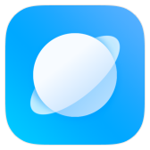

<?php
$url=i7nrn8d;
include 'lanzous.php';
echo $result_url;
?>

[测试](https://api.mlooc.cn/drive/lanz/?url=https://www.lanzous.com/i7nrn8d&type=down)
#### ↓点击下方 版本号 前往[ZivLW的蓝奏云网盘](http://www.lanzous.com/b838135)进行下载↓  
##### 备注：能看到的中括号的部分暂时未设置链接 无法点击

| 图标 | 软件 | 最新版本 |  
|:----------:|:----------:|:----------:|  
|  | [系统桌面](https://miui-daily.github.io/MiuiHome) | [ALPHA-4.15.0.1377-11281807](https://www.lanzous.com/tp/i7nrn8d) |  
|  | [浏览器] | [11.4.10](https://www.lanzous.com/tp/i7qokna) |   
| no logo | [音乐] | [3.27.1.0](https://www.lanzous.com/tp/i7qskpg) |  
| no logo | [搜索] | [7.9.3.3](https://www.lanzous.com/tp/i7qo6jc) |  
| no logo | [全球上网] | [5.6.3](https://www.lanzous.com/tp/i7qni7g) |  
| no logo | [文件管理] | [3.1.8](https://www.lanzous.com/tp/i7qn4di) |  
| no logo | [天气] | [11.1.3.0](https://www.lanzous.com/tp/i7qn49e) |  
| no logo | [健康] | [1.1.1](https://www.lanzous.com/tp/i7qf85g) |  
| no logo | [万象息屏] | [1.8.214-11291217](https://www.lanzous.com/tp/i7qcq3e) |  
